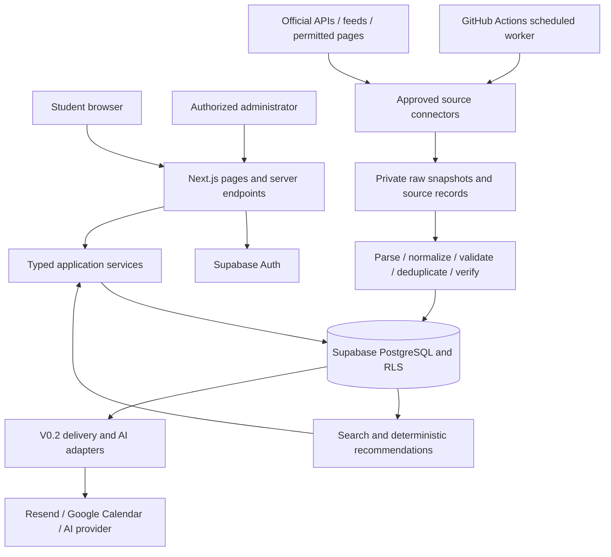

# Student Opportunities Platform — Section 35 planning package

Prepared 12 September 2026. Planning baseline v1.0.

> **Roadmap supersession — 22 September 2026:** The project owner has changed the current release to a **Manual-Content Product Beta**. Use [the current implementation roadmap and milestone status](implementation-roadmap.md) and `PROJECT_STATE.md` for execution order and current status. C09, live-source-dependent C10, C11 and C17 are **DEFERRED, not completed**, until after product completion and deployment. Preserve C07 research and C08/C08.5 infrastructure; no source permission is granted. C12 now proceeds from C05/C06, followed by C13 → C14 → C15 → C16 → C18 → C19, then the originally V0.2 product features, then C20 → C21. The original source-first dependencies, release staging, source-count/freshness launch gates, and “all tasks not started” statements below are historical and superseded where they conflict with this decision. Technical architecture, source safeguards and other product requirements remain in force. The historical no-code/no-infrastructure statements describe the original planning date, not current implementation progress.

Authority: `student_opportunities_master_instructions.md`, read in full, Sections 1–37. This package implements Section 35. The supplied document remains authoritative; decisions below fill implementation gaps and do not replace its requirements. No production code, infrastructure, accounts, source integrations, or external communications have been created.

## 1. Concise PRD

### Problem and promise

India’s college students need to find relevant technology events across fragmented sources, understand whether they can participate, and avoid missing deadlines. The platform combines discovery, explicit eligibility explanations, official links, and freshness information. The brief supplies the product hypothesis; user research and adoption baselines have not yet been collected.

Primary audience: undergraduate college/university students in India. Global countries, currencies, time zones, degrees, and institutions must fit the initial model. Organizers and administrators are secondary personas.

### Release scope

| Priority/release | Required outcome | Acceptance evidence |
|---|---|---|
| P0 / V0.1 | Authentication and private student profiles | Sign up, verify email, log in/out, recover access, edit profile, and delete account/data; another user cannot access private records |
| P0 / V0.1 | Reliable event inventory | 5–8 distinct approved sources run scheduled collection; canonical events retain their sources, official links, verification evidence, and successful check timestamps |
| P0 / V0.1 | Explore, search, filter, and sort | All brief Section 4.1 filters work together; query state is shareable; pagination is stable; empty and unavailable states are explicit |
| P0 / V0.1 | Event details and save | All Section 5 V0.1 fields render with unknowns labeled; registration opens the official destination; saves persist across sessions |
| P0 / V0.1 | Explainable recommendations | Deterministic weighted scores use the stated weights; eligibility failures cannot be overridden by interests; unknown rules do not become eligibility claims |
| P0 / V0.1 | Basic administration | Authorized staff can manage/publish events, inspect source failures, review duplicates and verification, refresh a source, and disable it |
| P0 / V0.1 | Usable and secure deployment | Mobile, keyboard, access control, production build, lint, meaningful tests, and deployment smoke checks pass |
| P1 / V0.2, required next release | Smart platform | Grounded AI, Google Calendar, .ics, email/in-app notifications, user-facing change detection, organizer submissions, and stronger administration |
| P2 / V1 | Public-product expansion | Stronger ingestion, verified organizers, global source coverage, advanced personalization, SEO/analytics/monitoring refinement, PWA/mobile and scalability improvements |

P1 means a committed later release here, not optional V0.1 work. Baseline privacy, authorization, accessible UI, error visibility, and launch documents are required from V0.1 even though V1 strengthens operations.

Included categories: hackathons, coding competitions, workshops, conferences, student technology events. Exclude internships, jobs, scholarships, payments, internal registration, social feeds, public messaging, team marketplaces, leaderboards, native apps, WhatsApp/Telegram, complex ML, microservices, Kubernetes, Elasticsearch, and blockchain functionality as specified in Section 30.

### Core user stories

- As an Indian student, I can filter opportunities by my course/year, interests, place, mode, dates, cost, and team requirements so I can find realistic choices.
- As a student, I can see the evidence, eligibility result, missing facts, and reason for a match so I can decide whether to visit the official registration page.
- As a returning student, I can edit my profile and retrieve saved events so my choices remain useful across devices.
- As a student with an incomplete profile, I can still browse and see exactly what information is needed for personalization.
- As an administrator, I can correct errors, review uncertain records and possible duplicates, and investigate stale/broken sources without publishing unsafe changes.
- In V0.2, as an organizer I can submit an event for moderation; as a student I can receive changes, export dates, and ask source-grounded questions.

### Pages and experience

V0.1: Home, Explore, Search (shared Explore engine), For You, Event Detail, Saved, Profile/Edit Profile, Login, Signup, About, Privacy, Terms, and basic Admin. V0.2: Notifications, AI Assistant, Submit Event, and organizer submission/status area. This stages Section 22’s full page inventory according to Sections 29 and 34; later features should not appear as nonfunctional controls.

Home remains a discovery surface: search, real trending events, For You when authenticated, Closing Soon, Online This Month, categories, recommendation explanation, source attribution, and profile CTA. Trending initially uses aggregate saves from the last seven days, with a minimum five distinct savers per displayed event. Hide the section if evidence is insufficient; do not fabricate activity.

Use editorial typography, clear grids, generous whitespace, and one restrained accent. Build the event model and functional Explore/Detail flow before homepage polish. Motion communicates state, respects reduced motion, and never blocks interaction.

### Proposed measurable targets

These operational thresholds make the brief testable; they are initial project decisions, not researched performance claims.

- 100% of published events have source evidence, a checked official destination, and a visible freshness/trust state.
- Zero known hard-ineligible events labeled eligible in the acceptance fixture suite; every uncertain case is labeled uncertain.
- 5–8 approved distinct sources each complete three consecutive scheduled cycles before V0.1 release, with at least one valid real event per source. A source with no current events needs a documented empty-catalogue check and a permitted historical fixture; it does not establish current inventory coverage alone.
- At least 95% of active events are within their configured refresh interval plus one scheduler interval during a seven-day staging observation. Display stale state for misses.
- At most 2% residual duplicates in a manually reviewed random sample of up to 100 published events; zero known false merges in the adjudicated test set. Report sample size and uncertainty.
- Proposed usability pilot: at least 8 of 10 representative students find, explain, and save a suitable event within five minutes without assistance. This is a target, not an achieved result.
- Measure profile-to-first-save conversion and seven-day return-to-discovery after launch. Establish the first two-week baseline before setting growth commitments; enable analytics only with the agreed privacy configuration.

## 2. Final system architecture baseline

One Next.js/TypeScript application and one Supabase PostgreSQL database. Use Tailwind and shadcn/ui as foundations, Motion for selective interactions, Supabase Auth, and Vercel hosting. Keep collectors in the same repository as modules executed by a scheduled worker. No separate service fleet or vector database is needed.



### Boundaries and request flow

- Public server-rendered pages read only published canonical events and safe source metadata. All user-specific queries execute in the authenticated user’s context and bypass shared page caches.
- Typed service functions own validation, eligibility, scoring, publication, and ingestion rules. Route handlers and server actions call the same functions; collectors do not reimplement them.
- Use PostgreSQL full-text search over title, summary, organizer, and tags, with GIN indexes and parameterized predicates. Use deterministic cursor pagination (24 results by default, capped at 100). Whitelist sorting: relevance, match, deadline, event date, newest, and prize amount within a selected currency. Never directly compare INR and USD prize numbers.
- The worker collects outside request-response paths. It commits normalized records through database transactions and uses privileged credentials only in its server environment. Manual refresh requests schedule work through connector `next_due_at`; web responses do not wait for scraping.
- Store permitted raw snapshots in private Supabase Storage, with source metadata and hashes in PostgreSQL. Never publicly expose raw content, contact information, or credentials.
- V0.2 notification processing consumes committed event changes, with per-recipient idempotency keys. An AI adapter retrieves authorized canonical records and supporting evidence before generation; source text is untrusted data and cannot issue instructions or trigger privileged actions.

### Scheduling decision

Select GitHub Actions for V0.1 ingestion, one scheduled sweep every hour at minute 17 plus manual dispatch. This is within the brief’s allowed alternatives and supports longer bounded collector work without depending on browser traffic. Vercel Hobby cron currently allows only daily execution; see [Vercel cron limits](https://vercel.com/docs/cron-jobs/usage-and-pricing). GitHub schedules can be delayed or dropped, and inactive public repositories can lose scheduled execution; see [GitHub schedule behavior](https://docs.github.com/en/actions/reference/workflows-and-actions/events-that-trigger-workflows#schedule). Therefore scheduling is best effort: each sweep claims all overdue work, and an overdue-health check appears in Admin. No exact-time freshness promise.

Default source policy: discovery daily; active-event refresh every 24 hours; refresh every six hours when a known registration deadline is within seven days; archived events weekly only where useful. The source’s permission and rate limits take precedence. Use an explicit stale indicator when a source cannot meet the target. Do not simulate higher cadence through many daily cron entries. Hosting/runtime quotas and repository usage budget must be checked during deployment setup; no paid plan has been purchased.

### Reliability and security

- Claim one source at a time using a database lease, expiry, and fencing token. An expired worker cannot commit over the replacement worker. Concurrency and request budgets are per host.
- Commit canonical changes, source observations, history, and checkpoint updates transactionally at bounded page/item boundaries. Retry is safe after a crash; partial and failed runs remain visible.
- Maintain `last_attempt_at` separately from `last_checked_at`. A timeout or parser failure never makes an event look fresh. A validated 304 may count as a successful check of previously valid content.
- Preserve known data when a refresh is incomplete. A field missing from a response is not a deletion; explicit authoritative clearing is a separately evidenced update.
- 404/410 is evidence of a missing source page, not proof that the event was cancelled. Retain history, mark source availability, and send to review after two separate checks. Only explicit evidence establishes cancellation.
- RLS: anonymous users read published events/public lookups; users read/write their own profile, interests, skills, and saves; only staff can moderate; worker writes remain private. Supabase requires RLS on exposed tables and service-role keys must not reach browsers: [Supabase RLS documentation](https://supabase.com/docs/guides/database/postgres/row-level-security).
- Store roles in a protected membership table; never trust editable profile metadata for admin authorization. Recheck authorization in every mutation and enforce database policies, not merely hidden navigation.
- Validate all external/form data; render sanitized text; prevent stored XSS; parameterize SQL; restrict URL schemes. Fetch only reviewed hosts, reject private/link-local addresses, and revalidate DNS and every redirect to prevent SSRF.
- Use secret stores for service credentials, redact logs, validate session/CSRF boundaries, rate-limit authentication-adjacent and expensive endpoints, and keep dependencies pinned. Deletion removes user-owned data and revokes provider tokens; audit history is minimized/anonymized under the retention policy.
- Proposed retention: raw snapshots 30 days unless a source allows less; redacted sync diagnostics 90 days; minimal field evidence while a published claim needs support. Confirm retention and backup deletion handling before launch.
- Maintain staging/production separation, additive migrations, deployment rollback instructions, database backups and a restore exercise. Add baseline error reporting before release; PostHog/Sentry integrations follow the brief and never collect secrets, raw profiles, or chat bodies by default.

### V0.2 extension contracts

Google Calendar uses explicit OAuth consent and minimum required scope, encrypted server-held refresh tokens, per-user authorization, token revocation, and idempotent exported item IDs. Universal .ics uses stable UIDs and correct time-zone/all-day semantics. Exports include distinct registration deadlines only when known. A downloaded .ics does not promise later automatic updates.

Notifications use in-app records plus Resend delivery, preferences, unsubscribe handling for optional mail, retries, and uniqueness across `(user, event change/reminder, channel)`. Publish/update transactions do not directly send mail.

AI uses a provider-neutral interface for retrieval-backed responses. Source citations accompany event claims; absent or conflicting eligibility/deadlines/prizes produce uncertainty. Separate preparation suggestions from verified event rules, minimize profile information sent to providers, and never interpret source content as system instructions.

## 3. Source constraints and acquisition strategy

Research status: official policies checked on 12 September 2026. This is a technical acquisition assessment with evidence and unresolved permissions, not a claim that any provider has granted access. No catalogue API, rate limit, robots permission, or redistribution license has been assumed from a publicly reachable endpoint.

| Candidate | Evidence and constraint | Connector decision / next proof required |
|---|---|---|
| Devpost | Terms expressly prohibit scraping/crawling and restrict content/branding reuse. [Official terms](https://info.devpost.com/legal/terms-of-service) | Disabled for automated collection absent a written exception or licensed feed/API agreement covering this use. Do not implement an unofficial listing scraper |
| Unstop | The official terms URL was located but the research reader returned no usable policy body. [Terms page](https://unstop.com/legal/terms-of-use) | Permission unresolved. Obtain/read the full applicable terms and verify catalogue access/reuse rights; internal website endpoints are not an approved API contract |
| Devfolio | Official terms were readable; this review did not establish a public catalogue API or aggregation/republication permission. [Terms of use](https://devfolio.co/terms-of-use) | Permission unresolved. Seek a documented feed/API or explicit permitted-page collection and reuse basis |
| HackerEarth | Terms restrict unauthorized third-party distribution and content reproduction. Public product/API references do not establish an event catalogue license. [Official terms](https://www.hackerearth.com/terms-of-service) | Disabled pending a suitable agreement or documented permitted interface; assessment/code execution APIs do not satisfy event discovery |
| MLH | Terms limit site use to personal/non-commercial purposes and restrict republication without written consent. [Official terms](https://www.mlh.com/terms) | Disabled for aggregation pending written permission/feed agreement; MyMLH registration functionality is not evidence of a licensed catalogue feed |
| Company event pages | No specific company/domain is named in the brief; no blanket permission can be concluded | Review each organizer’s exact domain, terms, robots rules, copyright policy, and official event link; prefer authorized JSON/RSS/ICS or structured pages |
| University pages | Permission and page formats vary by institution; a college website being public is insufficient evidence | Prioritize recurring campus event feeds with explicit reuse permission; record each institution as a distinct source |
| Government/student portals | No specific portal or dataset license is named | Evaluate each portal and dataset separately; government publication does not establish a universal reuse license |
| Conference/event websites | Event pages, ticketing providers, and image owners may have different terms | Prefer organizer-supplied facts/feeds; validate the separately hosted registration destination and rights for images |

Engineering policy for every source: record terms URL/date/hash, robots URL/date and effective rule for the exact user agent/path, access method, permission/license evidence, attribution/retention requirements, allowed fields/media, request budget, contact route, and review expiry. Robots rules are an additional collection constraint, not the license itself. Unknown or expired permission disables collection pending review. Stop on access denial/CAPTCHA; do not rotate identities or bypass controls. Store factual summaries and permitted evidence, not mirrored full descriptions or logos by default.

Technical qualification must test pagination, stable identity, editions/recurrence, date precision, time zones, dynamic markup, status changes, redirect behavior, malformed responses, conditional requests, and permitted extraction fidelity. Store parser version and fixtures only to the extent allowed. API credentials, data rights, and operational quotas are separate checks.

### Route to 5–8 reliable sources

Keep all five named platforms in the candidate list; none is currently certified integration-ready by this research. In parallel with future platform permission work, qualify named university/company/government/conference feeds from the categories already allowed by Section 7. No external permission request has been sent.

The first implementation connector is the first source that passes the approval and fixture gate, preferably an organizer-authorized feed with stable IDs. A local permitted fixture can unblock pipeline development, but does not count as a live source. Five feeds from one provider or repeated pages from one catalogue do not meet the intended source diversity requirement. If fewer than five sources qualify, continue engineering but hold the V0.1 release gate; do not silently reduce the requirement or claim a manual inventory is automatic ingestion.

## 4. Canonical event schema

This is the schema specification for subsequent migrations, not an applied migration. UUIDs are internal keys; stable source IDs are scoped to connectors. Nullable means unknown unless explicitly stated otherwise. Do not use empty arrays, zero amounts, false booleans, or midnight timestamps to disguise unknown data.

### `events`

| Fields | Type / rule |
|---|---|
| `id`, `slug`, `title` | UUID PK; unique stable text slug; nonempty text title |
| `short_description`, `full_description`, `participation_process` | Sanitized text; summary required for publication, extended fields nullable |
| `organizer_id`, `category_id` | FKs to organizers and event_categories; required for publication; category restricted to the five MVP categories |
| `official_url`, `registration_url` | Validated absolute HTTPS URLs required for publication, tied to source evidence; platform-hosted official event pages are allowed when the organizer uses them |
| `image_url`, `image_rights` | Nullable approved asset URL and usage/attribution evidence; no automatic copying |
| `start_date`, `end_date` | Nullable local calendar dates; preserve the date even when time is unknown |
| `start_at`, `end_at`, `timezone` | Nullable `timestamptz` instants and IANA zone; only derive instants when sufficient source information exists |
| `date_precision`, `date_metadata` | `unknown`, `date_only`, or `datetime`; validated JSON metadata retains per-endpoint precision, raw date strings, and the basis for any time-zone derivation |
| `mode` | `online`, `offline`, `hybrid`, or null |
| `venue`, `city`, `state`, `country` | Nullable text; country ISO two-letter code, not inferred merely from the visitor’s location |
| `latitude`, `longitude` | Nullable numeric, valid geographic ranges; no geocoding dependency required |
| `eligibility_text`, `eligibility_rules` | Original permitted factual rule text plus validated, versioned JSON expression described below |
| `eligible_years`, `eligible_degrees` | Nullable typed arrays for simple filters, derived from rules; explicit `any` lives in the rule expression, not an empty array |
| `individual_allowed`, `min_team_size`, `max_team_size` | Nullable boolean and positive integers; min ≤ max when both known |
| `fee`, `fee_max`, `fee_status`, `fee_basis`, `currency` | Nullable nonnegative decimal amounts; status `free`, `paid`, `varies`, `unknown`; basis `person`, `team`, `other`, `unknown`; ISO currency required for known monetary values |
| `prize_pool`, `prize_currency`, `prize_description` | Nullable nonnegative decimal and currency plus text for noncash/conditional prizes; do not sum mixed currencies or value in-kind awards without evidence |
| `status` | `announced`, `scheduled`, `ongoing`, `completed`, `postponed`, `cancelled`, `unknown`; separate from registration |
| `registration_status` | `not_open`, `open`, `closed`, `unknown`; reopening transitions to open and creates history |
| `publication_status` | `draft`, `review`, `published`, `unpublished`, `archived`; private workflow state |
| `verification_level` | `verified`, `source_confirmed`, `community_submitted`, or null for internal unassessed records |
| `verification_status` | `pending`, `current`, `stale`, `conflicted`, `rejected`; complementary evidence state, not another trust badge |
| `last_checked_at`, `source_updated_at` | Nullable timestamp of last successful validating check and known upstream update; not ingestion-attempt time |
| `created_at`, `updated_at`, `version` | Nonnullable timestamps and monotonically increasing integer for optimistic concurrency/change references |
| `merged_into_event_id` | Nullable self-FK; archived duplicate redirects to its canonical event; reject self-links and cycles |

The event read model includes `category`, `tags`, `registration_deadline`, stages, and sources by joining the normalized tables. `registration_deadline` is the primary active registration deadline from `event_deadlines`, not a second independently editable value. This preserves every Section 13 field without duplicate sources of truth.

Eligibility JSON uses an allowlisted AST: `all`, `any`, and predicates over student status, degree, study year, institution, participation country, and team size. Each predicate carries an evidence reference. Do not evaluate arbitrary expressions. Age, residency/nationality, or other requirements absent from the profile remain explicit unresolved conditions; do not infer them from degree or city. Denormalized filter arrays cannot express all compound rules and are never the final eligibility decision.

### Supporting tables and ownership

| Table | Essential columns and constraints | Release |
|---|---|---|
| `auth.users` | Supabase-managed identity; satisfies the brief’s users entity without duplicating passwords or auth identity | V0.1 |
| `profiles` | `user_id` PK/FK; name, institution, degree/course, year, city, country, category/mode preferences, travel willingness, preferred team size, optional portfolio links, updated_at; email remains in Auth | V0.1 |
| `interests`, `skills`, `user_interests`, `user_skills` | Controlled vocabularies and unique `(user_id, vocabulary_id)` links | V0.1 |
| `organizers` | id, name, website, normalized identity; public identity separated from private contacts | V0.1 |
| `event_categories`, `event_tags` | Category lookup; tags as unique `(event_id, tag, kind)` rows, kind `domain` or `skill`; skill tags map to skills vocabulary | V0.1 |
| `event_deadlines` | id, event_id, kind (`registration`, `submission`, `stage`), label, local_date, due_at, timezone, precision, source reference, active, is_primary; at most one active primary registration deadline per event | V0.1 |
| `event_sources` | id, event_id nullable until matched, connector_id, external_id, source_url, normalized_url, raw_storage_ref, content_hash, parser_version, last_attempt_at, last_checked_at, source_updated_at, availability, validated_observation JSON, field_evidence JSON; unique `(connector_id, external_id)` | V0.1 |
| `event_changes` | id, event_id, event_version, actor/source, reason, before/after field diff, evidence references, created_at; append-only; immutable approved observation needed to reconstruct evidence | V0.1 |
| `source_connectors` | id, name, source URL, type, enabled, permission_state/evidence, policy metadata, last_sync, last_successful_sync, status, error_count, next_due_at, lease token/expiry, cursor/checkpoint | V0.1 |
| `sync_runs` | id, connector_id, trigger, started/finished, status, counts, cursor start/end, redacted error summary, per-item error details capped with overflow in private storage | V0.1 |
| `saved_events` | user_id, event_id, created_at; composite PK makes repeat save idempotent | V0.1 |
| `admin_memberships` | user_id PK/FK, role, granted_by/at; protected from self-service writes | V0.1 |
| `duplicate_reviews` | canonical candidate pair, signals, status, decision/reason/actor; unique ordered pair; supports reject, merge, and later correction | V0.1 |
| `organizer_submissions` | submitter, private contact, validated proposed event payload, evidence, moderation state, linked event, decision log | V0.2 |
| `calendar_exports` | owner, event/deadline, provider, external_id/UID, exported_version, exported_at; unique destination identity | V0.2 |
| `notifications`, `notification_preferences` | owner, event/change, channel, idempotency key, send/read/retry states; owner preferences and unsubscribe state | V0.2 |
| `chat_sessions`, `chat_messages` | owner/session FK, role, content, retrieved event/version/source references, created_at; private access and bounded retention | V0.2 |

Added `admin_memberships` and `duplicate_reviews` are justified by explicit protected administration and duplicate-review requirements; they prevent unsafe role storage and lost adjudications. Field evidence is initially bounded JSON on source records plus immutable history, avoiding an additional table until query/volume needs justify it. Add other provider-token storage or delivery tables only when their V0.2 feature is implemented.

### Invariants, indexing, and publication

- Enforce date order when comparable, amount/team ranges, FK integrity, allowed enums, stable slugs, and unique source identity in PostgreSQL as well as input validation.
- Keep year/degree aliases explicit (e.g., mapped course names) and retain raw source terminology. An unknown country or degree is not automatically Indian/undergraduate.
- Publication requires title, summary, organizer, supported category, official/registration URLs, at least one valid source observation, a successful check, assigned trust level, and no unresolved critical conflict. Optional facts may remain visibly unknown; do not fill them to pass validation.
- Index published status with event/deadline dates, mode/country/city, category, and relevant relation keys. Index tags and the search vector. Add indexes based on measured query plans rather than every possible combination.
- Time-derived registration closure applies only to a known instant. For a date-only deadline show “time not specified,” avoid precise countdowns, and conservatively stop recommending registration after that source-local date where its zone is known. Unknown time zones require review, not assumed IST.

## 5. Source connector interface and pipeline rules

The following is a design contract to implement later, not production code.

```typescript
type ConnectorKind = 'api' | 'feed' | 'structured_page' | 'permitted_scrape';
type CheckResult =
  | { kind: 'record'; record: RawRecord }
  | { kind: 'not_modified'; externalId: string; checkedAt: string }
  | { kind: 'missing'; externalId: string; checkedAt: string; status: 404 | 410 };

interface RawRecord {
  externalId: string;         // stable within connector, including edition
  sourceUrl: string;
  fetchedAt: string;
  sourceUpdatedAt?: string;
  contentType: string;
  contentHash: string;
  permittedPayloadRef: string; // private snapshot, subject to retention
  etag?: string;
  lastModified?: string;
}

interface ConnectorContext {
  runId: string;
  now: string;
  signal: AbortSignal;
  cursor?: string;
  maxItems: number;
  fetch: PolicyBoundFetcher;  // allowlist, permission, rate and size enforcement
}

interface SourceConnector {
  id: string;
  version: string;
  kind: ConnectorKind;
  discover(ctx: ConnectorContext): Promise<{
    items: RawRecord[];
    nextCursor?: string;
    complete: boolean;
  }>;
  refresh(ctx: ConnectorContext, externalId: string): Promise<CheckResult>;
  parse(raw: RawRecord): Promise<{
    candidate: EventCandidate; // untrusted partial canonical field observations
    evidence: FieldEvidence[]; // field, value, source locator, method, observed time
    warnings: string[];
    parserVersion: string;
  }>;
}
```

`PolicyBoundFetcher` is the shared HTTP client; connectors cannot bypass it. `EventCandidate` mirrors the canonical fields as optional observed values, preserves raw date/eligibility strings, and distinguishes absent from explicit clearing. `FieldEvidence` includes source record ID, field path, observed value, document locator/permitted excerpt, extraction method (`structured`, `parser`, `ai`, `manual`), checked time, and validation state. These contracts receive runtime schema validation in the implementation.

Connector errors have a code: `permission_denied`, `rate_limited`, `authentication_failed`, `network_error`, `parse_error`, `schema_error`, or `budget_exceeded`; include retryability, redacted detail, and optional retry-after. Retry transient errors at most three times with exponential backoff/jitter, honoring Retry-After; leave deferred work for a later sweep. Pause and flag repeated failures, permission denial, or expired policy. One bad item cannot silently discard an entire valid page.

Shared pipeline: policy gate → collect → retain permitted raw evidence → parse → normalize → validate → deduplicate → verify → transactionally publish/update or quarantine → update searchable data/cache. AI extraction is optional and never needed for the first connector. No connector can set its own public verification badge or directly publish arbitrary records.

### Deduplication and canonical updates

1. Same connector/external edition ID updates its existing record idempotently.
2. Exact normalized event-specific official/registration URL plus compatible organizer and edition/date evidence may attach to an existing canonical event. Strip known tracking parameters only; retain identity-bearing parameters.
3. Broad organizer URLs, annual reusable URLs, and contradictory edition dates never auto-merge. Title similarity, organizer identity, overlapping dates, and domain form review candidates. Proposed fuzzy title threshold 0.90 is review-only until measured against adjudicated fixtures.
4. Resolve fields using explicit authoritative corrections, then current organizer evidence, then current trusted platform evidence, then community observations. A stale organizer page does not silently beat a recent conflicting platform deadline: quarantine that critical field for review.
5. Lock candidate events and source identity within the commit transaction. Database uniqueness plus retry handles concurrent discovery. Never rely on a pre-insert lookup alone.
6. Merge records with retained source mappings, a canonical redirect, saved-event reconciliation, and audit history. Store pre-merge association data so an erroneous merge can be corrected without losing provenance.

Meaningful changes in V0.1 are recorded for audit and update the listing; automated user change notifications are V0.2. This foundation is necessary for truthful refresh behavior and does not pull the V0.2 notification feature forward.

## 6. Recommendation scoring rules

Version: `deterministic-v1`. Preserve the brief’s weights exactly: eligibility 25, interests 25, skills 15, location/mode 10, academic year 10, category 10, other preferences 5.

### Eligibility is a separate gate

Evaluate the complete source-grounded rule AST in three-valued logic: true, false, unknown. For `all`, any false means false, otherwise unknown propagates; for `any`, any true means true, otherwise unknown propagates. Unsupported/unparsed restrictions are unknown. “All students” is a positive supported rule; a missing eligibility section is not.

- `appears_eligible`: every applicable hard rule evaluates true using current, non-conflicting evidence.
- `not_eligible`: at least one required condition fails, after respecting OR alternatives.
- `needs_confirmation`: missing profile fact, incomplete rule extraction, unresolved condition, stale critical evidence, or conflict prevents a reliable decision.

Academic year participates in the hard gate when required, even though it also retains its own 10-point scoring component. Eligibility’s 25-point component measures non-year hard restrictions to reduce double counting. A team-size preference is not proof of an actual team; if no actual size is known, team-dependent eligibility stays conditional unless individual entry is explicitly allowed and the student’s path is individual.

Default For You excludes known ineligible, cancelled, completed, and closed-registration events. It ranks eligible opportunities first and clearly separates opportunities needing confirmation. Explore and saved/detail views can still show excluded events with reasons. Closed registration is availability, not personal ineligibility.

### Component definitions

Each component returns value in [0,1] or unknown. For a criterion explicitly unrestricted, use 1. Do not award unrestricted credit merely because the field is absent.

| Component | Weight | Deterministic value |
|---|---:|---|
| Non-year eligibility | 25 | 1 when supported non-year hard rules pass or are explicitly unrestricted; 0 on a proven failure; unknown if unresolved |
| Interests/domains | 25 | Number of event domain tags overlapping profile interests divided by number of event domain tags; unknown if either set is missing/empty |
| Skills | 15 | Number of event skill tags overlapping user skills divided by number of event skill tags; unknown when skill evidence/profile is absent; a suggested skill is not automatically a hard requirement |
| Location/mode | 10 | 1 for an explicitly supported participation route matching mode preference and location/travel preference; 0.5 for a supported route with a known soft preference mismatch; 0 if no known acceptable route; unknown if route/profile facts are insufficient |
| Academic year | 10 | 1 for matching/explicitly unrestricted year, 0 for excluded year, unknown if missing; course-year interpretation uses the rule’s degree context |
| Category | 10 | 1 if the event category is preferred (or user explicitly chose any), 0 if not; unknown if no preference is supplied |
| Other/team preference | 5 | 1 if known supported team-size options intersect the expressed preference, 0 if disjoint, unknown if either is missing |

Location checks: online routes do not require travel; offline routes require same city or a stated willingness to travel; hybrid evaluates each evidenced route and takes the best. Country participation restrictions are hard eligibility rules and cannot be overridden by travel preference. “Willing to travel” is a soft preference only, not proof of visas, budget, or access.

Let K be the sum of weights with known values, and E the sum of their weight × value. When K > 0, `score = round(100 × E / K)` and `coverage = K / 100`. When K = 0, score is null. Show a numeric percentage only if coverage ≥ 0.75, the profile has the relevant required fields, and eligibility is `appears_eligible`. Otherwise show “Needs confirmation” or “Complete your profile,” with known reasons and missing facts, not a misleading percentage. The coverage threshold is a proposed presentation rule; weights are unchanged.

For numeric scores, match levels are strong ≥80, moderate 60–79, lower <60. Rank eligible numeric results by score, then coverage, known upcoming deadline, then event ID. Rank uncertain results in a separate group by known relevance and freshness; never present a provisional score as eligibility certainty. Store scoring version in logs/debug responses and compute using the current event version/profile; begin without a persistent recommendation table.

### Worked acceptance examples

- All facts known; non-year eligibility 1, interest 0.5, skills 0.5, location 1, year 1, category 1, team 1 → 80 points, 100% coverage, “80% match.” Explain the actual overlapping tags and supported rules.
- Identical event but official rule excludes the student’s year → `not_eligible`, no headline match percentage, excluded from default For You even if its other components score highly.
- Degree requirement unknown with everything else known and matching → eligibility unknown, coverage at most 75%, “Needs confirmation”; do not say eligible or display 100%.
- Missing interests and skills leaves at most 60% coverage → prompt for profile information, not a high-confidence score.
- Online event restricted to another country → hard ineligibility if the country condition is known to fail; online mode supplies no exemption.

Explain using templates driven by actual scoring/rule evidence. Do not generate invented reasons. A match percentage is relevance, never a probability of admission or organizer approval.

## 7. Verification model

Keep exactly the three public trust levels specified in Section 6.

| Level | Evidence required | Publication behavior |
|---|---|---|
| Verified | Current organizer-controlled official source supports event identity and official registration destination; displayed critical claims have checked evidence | Show organizer link and checked time; label any individual unknown field |
| Source Confirmed | A reviewed trusted platform supports identity and registration destination; organizer-level confirmation absent | Show platform link and checked time; do not imply organizer verification |
| Community Submitted | Submitted event has valid identity/source links and passes admin moderation, but is not fully corroborated | Clearly labeled; no automatic upgrade and no eligibility certainty without supporting evidence |

Internal draft/pending state has no public badge. Successful parsing alone does not establish verification. AI-derived candidate values remain unverified until compared with supporting source content through a deterministic validator or an administrator.

Critical fields: identity/edition, organizer, official and registration URLs, dates/deadline, eligibility/team restrictions, fee, cancellation and registration status. Store field-level evidence and review status; an event badge is not a claim that absent facts are known.

Promotion: community → source confirmed after trusted-platform corroboration; either → verified after organizer corroboration. Record evidence, method, reviewer or validation version, and time. Contradiction → conflicted review state; expired evidence → stale state. Remove the current trust badge while critical verification is unresolved, displaying “Verification needs refresh” and preserving the historical level internally. Unsafe or materially misleading records are unpublished until resolved.

Default freshness rules follow the source cadence in Section 2. `last_checked_at` is displayed separately from trust. A previously verified cancelled event can remain verified as cancelled when current evidence supports that fact. A dead link alone cannot change its lifecycle to cancelled.

## 8. V0.1 milestones

No delivery date or staffing capacity was supplied. Milestones are dependency-based, not invented calendar commitments.

| Milestone | Deliverable | Exit gate |
|---|---|---|
| M0 — Planning baseline | This package, source permission register template, acceptance rules | Section 35 complete; access gaps explicitly tracked |
| M1 — Foundation | Inspected repository, typed Next.js setup, environment template, Supabase migrations/RLS, Auth, minimal admin role | Build/lint pass; migrations replay; two-user isolation and no privilege escalation |
| M2 — Event vertical slice | Validated canonical CRUD, audit evidence, minimal Explore/Detail | Valid event can be created by admin and safely read publicly; drafts/private content inaccessible |
| M3 — First ingestion slice | First approved source, collector contract, normalization, idempotent writes, sync logs, duplicate review | Real permitted record ingested; rerun/concurrent replay creates no duplicate; failure keeps previous valid state |
| M4 — Discovery and relevance | Full search/filtering, profile fields, rule engine, deterministic scoring, richer details, saves | Acceptance fixtures pass; every required filter works; private saves remain isolated |
| M5 — Source coverage and operations | 5–8 qualified sources, recurring refresh, basic Admin, history and health, finished discovery Home | Three successful cycles/source, seven-day freshness observation, adjudicated duplicate sample |
| M6 — Release readiness | Design/motion refinement, mobile/accessibility, security review, deployment, launch policies, monitoring | All Section 34 V0.1 criteria signed off with recorded evidence; rollback/restore and deployed smoke checks pass |

Permission work may proceed alongside engineering. Authorization must protect event CRUD from M2; the broader admin UI is built later. Automated tests for security and ingestion accompany the relevant implementation; comprehensive acceptance follows at M6. These dependencies justify the small sequencing clarifications to Section 28.

## 9. Implementation task list for Codex

Each row is an independently reviewable change. Status for all tasks: not started. Follow the IDs in order except explicitly independent policy work. Do not combine them into one rewrite.

| ID | Task and scope | Depends on | Required verification / definition of done |
|---|---|---|---|
| C01 | Inspect the intended repository, read applicable AGENTS instructions, report existing code and preserve working behavior | Planning | Record branch/runtime/current checks; no assumption this planning folder is the application repository |
| C02 | Establish typed Next.js, Tailwind/component foundation, lint/type/build scripts and environment documentation | C01 | Clean install and production build; no secrets committed; versions pinned |
| C03 | Add canonical/auth-support migrations, constraints, indexes and explicit RLS | C02 | Migration replay in isolated database; anonymous/user A/user B/admin access matrix; invalid data rejected |
| C04 | Implement Supabase signup/login/logout, verification/recovery and protected staff membership | C03 | Session expiry, recovery, authorization escalation and two-user isolation checks |
| C05 | Implement shared event validation, admin CRUD, optimistic versioning, publication and history | C04 | Draft isolation, invalid URL/date rejection, unauthorized mutations denied, concurrent-edit conflict |
| C06 | Minimal Explore and Event Detail using actual database records | C05 | Pagination, missing-field labels, source links, external registration and mobile keyboard smoke check |
| C07 | Qualify exact first source and maintain permission records for 5–8 candidates | Independent from C02 | Document API/feed/page rights, robots, limits, sample payload and approved fields; no undocumented endpoint dependency |
| C08 | Implement shared fetch/connector contracts, private raw storage and sync run tracking | C03, C07 first source | SSRF/redirect/size guards, redacted errors, rate limit and timeout fixtures |
| C09 | Add first collector, parser, normalization, publication validation and field evidence | C05, C08 | Permitted real sample plus malformed/date-only/timezone fixtures; uncertain records quarantined |
| C10 | Add duplicate-safe ingestion, canonical resolution and review/merge support | C09 | Replay and concurrency idempotency; recurring editions kept distinct; merge reversal preserves source mappings and saves |
| C11 | Schedule bounded worker with leases/checkpoints, refresh and source-health views | C10 | Crash/resume, 304, partial page, expired lease, 404 and repeated failure tests; deployable schedule configuration |
| C12 | Complete full-text search, all Section 4.1 filters, supported sorts and URL query state | C11 | Combined filter/query fixtures; unknown eligibility not treated as a match; currency-safe prize sorting; stable paging |
| C13 | Complete student profile and interests/skills/preferences editing | C12 | Validation and privacy; incomplete profile permitted; no fabricated defaults; degree/year aliases tested |
| C14 | Implement three-valued eligibility and versioned weighted recommendations/explanations | C13 | All Section 6 examples, OR rules, unknown restrictions, stale evidence, and exclusion tests |
| C15 | Complete Section 5 event details and For You experience | C14 | Every V0.1 field present or explicitly unknown; score sources explainable; unavailable registration clearly labeled |
| C16 | Implement idempotent saves and Saved view | C15 | Repeat save/remove, refresh persistence, cross-account isolation, merged-event association |
| C17 | Extend approved connectors to 5–8 distinct real sources and tune freshness | C07, C11, C16 | Qualification evidence per source; three successful scheduled cycles; seven-day freshness measurement |
| C18 | Finish basic Admin: source controls, verification, duplicates, event history, failed runs and publish/unpublish | C17 | Role checks on every action; manual refresh is bounded/idempotent; decisions auditable |
| C19 | Finish discovery Home, real trending calculation, responsive design system and restrained motion | C18 | No fake metrics/logos; keyboard/focus/contrast/reduced-motion and mobile checks; performance measurement |
| C20 | Complete account deletion, security/privacy review, public About/Privacy/Terms and operational setup | C19 | Deletion including dependent data; secret scan; RLS review; documented policy/source access blockers resolved before launch |
| C21 | Deploy staging, run complete acceptance, configure production and verify recovery | C20 | Build/lint/type/tests; deployed end-to-end signup → profile → search → detail → save; backup restore and rollback; Section 34 evidence checklist |

For every meaningful change: report changed behavior, tests/build/lint outcomes, migrations/environment changes, and remaining risks. Use integration tests for RLS and transactional ingestion, unit fixtures for parsing/eligibility/deduplication, and a small end-to-end suite for core student/admin journeys. A UI-only snapshot is not proof of database authorization.

After V0.1, continue in the brief’s dependency order: calendar → notifications → AI → organizer submissions → expanded admin → refinement and QA. V0.2 implementation must include OAuth failure/revocation, calendar date precision, duplicate delivery prevention, grounded-answer evaluation, and submission moderation tests.

## 10. Decision log, remaining gates, and Section 35 completion

### Explicit interpretations and justified additions

- Sections 29/34 govern release staging when earlier sections describe the whole product. Calendar/AI/notifications/submissions stay in V0.2.
- Keep the recommended stack. GitHub Actions is selected from the document’s permitted scheduler choices because V0.1 refresh targets exceed daily Hobby cron.
- Separate lifecycle, registration, publication, verification level, and freshness state because one overloaded status cannot represent their combinations correctly.
- Add date precision/time zones, prize currency, fee basis, field evidence, protected roles, and duplicate review records to implement accuracy, international readiness, and explicit existing workflows.
- Keep all seven recommendation weights; add eligibility gating and visible evidence coverage to prevent unsupported eligibility claims.
- Treat candidate sources as candidates, not promised integrations. The 5–8-source release requirement remains unchanged.
- Keep internal audit changes in V0.1 to make refreshes inspectable; defer automatic student change alerts to V0.2.

### Remaining gates with owners

| Gate | Owner | When it blocks |
|---|---|---|
| Intended application repository and deployment account selection | Project owner / Codex | Repository-specific setup; local planning is complete |
| Exact domains, permission evidence and usable interface for first source | Source operations / engineering; counsel where permission is ambiguous | First live connector, not fixture-based pipeline development |
| Five approved distinct sources and verified operational history | Source operations | V0.1 release |
| Hosting/job budget, data region, production domain and secrets | Project owner / engineering | Production infrastructure configuration |
| Applicable privacy/terms, student/minor handling, retention and source licensing | Project owner / qualified legal reviewer | Public launch; no age restriction or extra sensitive profile collection has been silently introduced |
| Final provider/OAuth setup for calendar, email, AI | Project owner / engineering | V0.2 integrations only |

These are implementation or release dependencies, not missing Section 35 deliverables. No permission requests, subscriptions, deployment, or external submissions have been made.

### Coverage map

| Section 35 item | Completion in this package |
|---|---|
| 1. Read entire file | Read Sections 1–37 before drafting |
| 2. Concise PRD | Section 1 |
| 3. Final architecture | Section 2 |
| 4. Legal/technical source constraints | Section 3, with official citations and explicit unknowns |
| 5. Canonical event schema | Section 4 |
| 6. Connector interface | Section 5 |
| 7. Recommendation rules | Section 6 |
| 8. Verification model | Section 7 |
| 9. V0.1 milestones | Section 8 |
| 10. Codex implementation tasks | Section 9 |

Next execution boundary: Section 36 begins with inspecting the intended application repository. This package is ready for that handoff; it does not claim that the application or live sources have been built.
